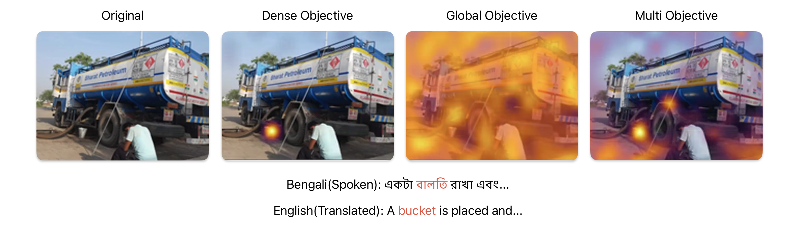
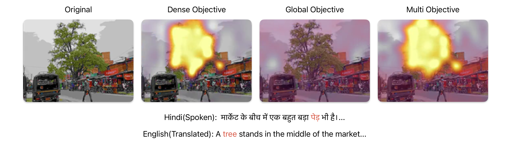

# VeS: Teaching Pixels to Listen Without Supervision

**Official implementation for the paper:**  
*"VeS: Teaching Pixels to Listen Without Supervision"*  
Sajay Raj, Indian Institute of Technology Madras  
21f3002325@ds.study.iitm.ac.in

## Abstract

Recent dense audio-visual (AV) models achieve impressive retrieval and emergent localization, but almost all evidence comes from English-centric, caption-rich web video. It is unclear whether these objectives survive in low-resource, code-switched, and noisy multilingual settings that typify developing regions.

**We show they do—and that the choice of aggregation function becomes even more critical.**

Using a multilingual subset of Project Vaani spanning dozens of Indian languages and dialectal variants, we compare three contrastive objectives:
- **Global mean-pooled loss** (CLIP-style)
- **Dense max-mean token matcher** (DenseAV-style) 
- **Simple hybrid** approach

**Key Finding:** The dense objective delivers a **+59% relative R@1** (Audio→Visual) improvement over global pooling and substantially lower mean/median ranks, while consistently producing sharp zero-shot localization heatmaps of spoken objects—despite keeping the vision backbone entirely frozen.

## Zero-Shot Localization Results

Our dense contrastive approach produces sharp localization heatmaps even with a frozen vision backbone:

<div align="center">
  
  
</div>

These heatmaps demonstrate the model's ability to precisely locate spoken objects in multilingual audio-visual content without any supervised localization training.

## Architecture Overview

```
┌─────────────────┐    ┌─────────────────┐
│   Audio Branch  │    │  Vision Branch  │
│                 │    │                 │
│ DistilHuBERT    │    │ DINOv2-Large    │
│ (Trainable)     │    │ (Frozen)        │
│                 │    │                 │
│ Stride-2 Pool   │    │ Lightweight     │
│ Projections     │    │ Adapters        │
└─────────────────┘    └─────────────────┘
         │                       │
         └───────────┬───────────┘
                     │
            ┌─────────────────┐
            │ Token-Level     │
            │ Similarity      │
            │ Aggregation     │
            └─────────────────┘
```

## Training

```bash
# Basic training with default configuration
python train.py

# Custom configuration
python train.py --config config/custom_config.yaml

# Training without cached visual features
python train.py --no-cached-features

# Fresh training (ignore existing checkpoints)
python train.py --no-resume

# Custom cached features path
python train.py --cached-features-path /path/to/your/cache
```

### Evaluation

```bash
# Evaluate trained model
python evaluate.py --checkpoint checkpoints/model.pt

# Evaluate with cached features
python evaluate.py --use-cached-features --cached-features-path /path/to/cache

# Test similarity computation
python evaluate.py --test-sim
```

## Project Structure
```
src/
├── models/                 # VeS model components
│   ├── audio_encoder.py   # DistilHuBERT audio encoder
│   ├── vision_encoder.py  # DINOv2 vision encoder with adapters
│   ├── ves_model.py       # Main VeS model
│   ├── losses.py          # Loss computation utilities
│   └── __init__.py
│
├── training/              # Training infrastructure
│   ├── trainer.py         # Main trainer class
│   ├── checkpoint_manager.py  # Checkpoint handling
│   ├── data_manager.py    # Data loading with deterministic shuffling
│   ├── config_loader.py   # YAML configuration loading
│   └── __init__.py
│
├── data/                  # Data processing
│   ├── dataset.py         # VAAPairedDataset implementation
│   ├── audio_processing.py    # Audio loading and preprocessing
│   ├── transforms.py      # Image preprocessing utilities
│   └── __init__.py
│
├── visualization/         # Attention visualization
│   ├── ves_visualizer.py  # Main visualization class
│   ├── video_encoder.py   # MP4 video generation
│   ├── heatmap_renderer.py    # Attention heatmap rendering
│   ├── image_utils.py     # Image processing utilities
│   └── __init__.py
│
├── evaluation/            # Retrieval evaluation
│   ├── retrieval_evaluator.py    # Main evaluation class
│   ├── similarity_computer.py    # Similarity computation
│   ├── embedding_extractor.py    # Embedding extraction with caching
│   ├── metrics.py         # Evaluation metrics
│   └── __init__.py
│
├── config/
│   └── train_config.yaml # Training configuration
│
├── train.py              # Main training script
├── evaluate.py           # Standalone evaluation script
└── README.md            # This file
```

## Configuration

Training is configured through YAML files. Key parameters:

```yaml
# Model Configuration
model:
  loss_type: "global"  # Options: "dense", "global", "dense_global"
  embedding_dim: 256
  hubert_name: "ntu-spml/distilhubert"
  use_cached_visual_features: true

# Training Configuration  
training:
  batch_size: 92
  num_epochs: 5
  learning_rate: 3.0e-4
  gradient_accumulation_steps: 2
  checkpoint_every_steps: 20000
  
# Logging
wandb:
  enabled: true
  project: "VeS"
  name: "experiment-name"
```

## Results

### Retrieval Performance

| Loss Type | Direction | R@1 (%) | R@5 (%) | R@10 (%) | Mean Rank |
|-----------|-----------|---------|---------|----------|-----------|
| **Dense** | Audio→Visual | **9.90** | **24.06** | **32.54** | **266.0** |
| **Dense** | Visual→Audio | **8.50** | **21.18** | **29.66** | **252.4** |
| Global | Audio→Visual | 6.22 | 16.52 | 23.88 | 339.8 |
| Global | Visual→Audio | 6.38 | 16.54 | 24.08 | 341.8 |
| Hybrid | Audio→Visual | 9.00 | 21.86 | 29.32 | 283.0 |
| Hybrid | Visual→Audio | 7.46 | 20.32 | 28.44 | 271.2 |

### Localization Quality

The dense loss produces **sharp, accurate localization heatmaps** that correctly highlight spoken objects across multiple Indian languages, while global loss fails to provide meaningful spatial attention.

## Methodology

### Loss Functions

1. **Dense Loss (Recommended)**
   ```python
   # Audio-to-visual aggregation: max over patches, mean over tokens
   a2v_max = token_similarities.max(dim=patches).values
   dense_similarity = (a2v_max * attention_mask).mean()
   ```

2. **Global Loss**
   ```python
   # Mean pool both modalities, then compute similarity
   audio_global = audio_tokens.mean(dim=time)
   visual_global = visual_patches.mean(dim=patches)  
   global_similarity = cosine_similarity(audio_global, visual_global)
   ```

3. **Hybrid Loss**
   ```python
   hybrid_loss = λ * dense_loss + (1-λ) * global_loss
   ```

### Data Processing

- **Audio**: 16kHz, 5-second clips, DistilHuBERT tokenization
- **Vision**: 224×224 images, DINOv2-Large patch extraction
- **Multilingual**: 83+ Indian languages and dialects
- **No supervision**: No captions, transcripts, or spatial annotations

## Training Tips

1. **Start with cached features** for faster iteration
2. **Use dense loss** for best retrieval and localization performance  
3. **Monitor attention visualizations** to verify model learning
4. **Adjust batch size** based on your GPU memory
5. **Enable gradient accumulation** for effective larger batch sizes

## Contact

- **Sajay Raj** - 21f3002325@ds.study.iitm.ac.in

## Acknowledgments

- **Project Vaani** team for the excellent multilingual dataset
- **My dad** for the stupid compute budget

## License

This project is licensed under the MIT License - see the [LICENSE](LICENSE) file for details.

#### Codebase refactored by Claude Code